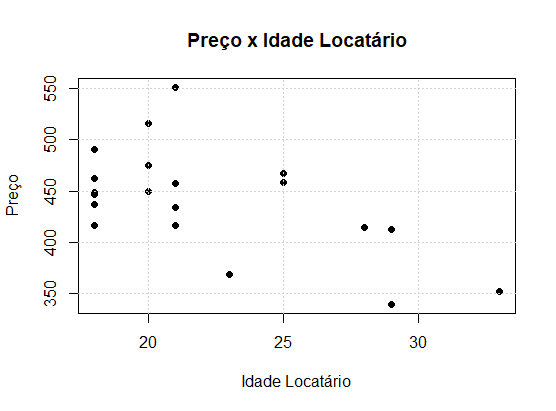
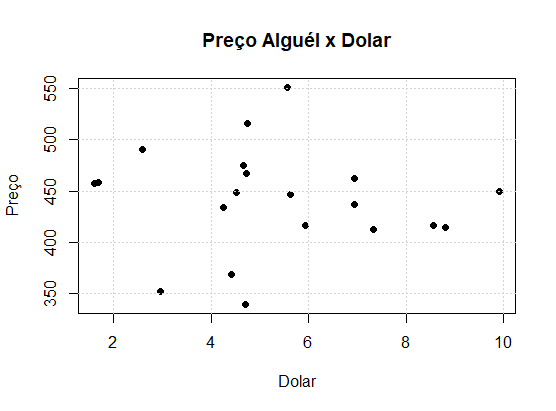
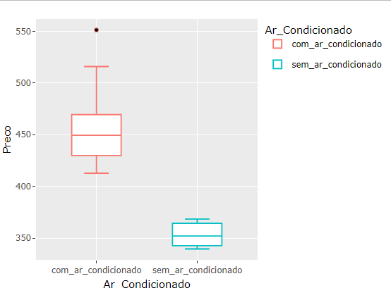
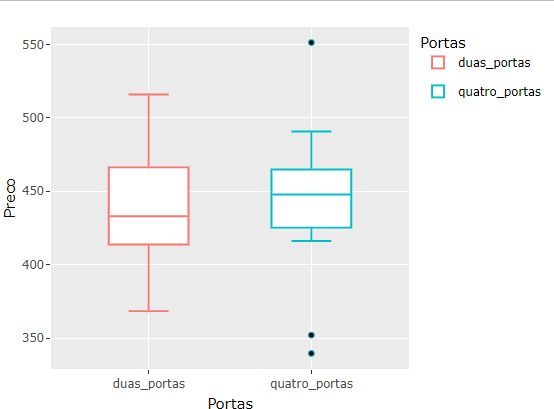
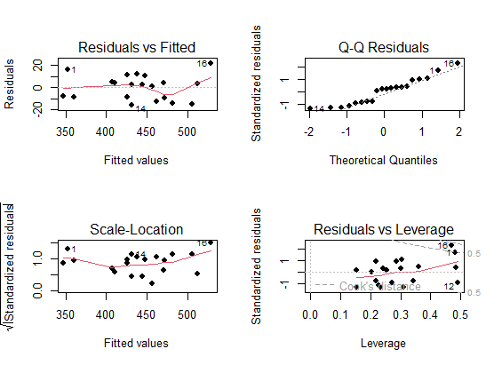
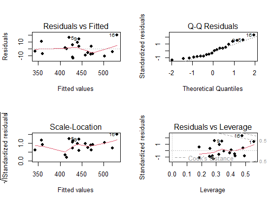

# APLICAÇÃO DE MODELO MATEMÁTICO DE REGRESSÃO LINEAR MÚLTIPLA - LINGUAGEM R:
Uma agência de aluguel de veículos disponibilizou dados de aluguéis realizados.
Com o modelo matemático criado é possível:
* prever o valor do alugél do veículo em função de outras variáveis
* gerar estimativas descritivas do processo "explicação".

Com estas informações a gerência pode conhecer melhor seu processo, sabendo como e quanto cada variável contribui para o seu faturamento, permitindo prever valores, aplicar promoções ou acréscimos nos preços de acordo com cada situação. Dentre outras possibilidades de gestão.

Vídeo apresentando o algoritmo (resumido):
https://www.linkedin.com/posts/renancaetan0_regressaolinearmultipla-rstudio-activity-7188831568960897025-CE9U?utm_source=share&utm_medium=member_desktop

## Instalando bibliotecas e carregando dados iniciais

Instala a biblioteca de gráficos

```
install.packages('ggplot2')
install.packages('plotly')
```
Carrega bibilioteca de Gráficos
```
library(ggplot2)
library(plotly)
```
Inibe notações científicas

```
options(scipen = 666)
```

Carrega dados de aluguéis de carros que a agência de aluguél de veículos disponibilizou.
Preço | Portas | Ar Condicionado | Quadrimestre | Idade do Locatário | Quilometragem | Dolar
obs.: "Preço" se refere ao Preço do Aluguél do Veículo.

```
dados <- data.frame(
  Preco = c(368.384514890573, 446.850186825816, 
            414.72765691978, 434.291090918223, 436.652686535348, 457.65797344255, 
            490.694346597566, 474.881781399868, 458.462395897205, 412.719412673294, 
            448.799032112411, 352.040747235864, 449.461858221104, 416.150953927119, 
            416.499426750268, 551.315803331779, 462.126789471159, 515.957335395508, 
            467.598697162974, 339.548470369391), 
  
  Quilometragem = c(957.442780544097, 829.533278217768, 923.300215829467, 871.519116905113, 930.704105677958, 554.696695914233, 501.941059782271, 
                    665.435074822519, 568.24079543466, 930.704105677958, 554.696695914233, 
                    829.533278217768, 665.435074822519, 871.519116905113, 930.704105677958, 
                    351.547138218644, 501.941059782271, 447.872006186523, 568.24079543466, 
                    930.704105677958), 
  
  Idade_Locatario = c(23, 18, 28, 21, 18, 21, 18, 20, 25, 29, 18, 33, 20, 21, 18, 21, 18, 20, 25, 29),
  
  Dolar = c(4.41147933990862, 5.63014407874318, 
            8.80557934010615, 4.260591319988649, 6.93416279643155, 1.61130694543154, 
            2.57813244655973, 4.66666728709914, 1.6846066723224, 7.33872353619711, 
            4.52300814589177, 2.96689816205009, 9.91448182957733, 8.55577847959413, 
            5.93424935955983, 5.55775429484673, 6.94475470863839, 4.74330294976712, 
            4.723306965757987, 4.7010894862212),
  
  Ar_Condicionado = c("sem_ar_condicionado",  "com_ar_condicionado", "com_ar_condicionado", "com_ar_condicionado", 
                      "com_ar_condicionado", "com_ar_condicionado", "com_ar_condicionado", 
                      "com_ar_condicionado", "com_ar_condicionado", "com_ar_condicionado", 
                      "com_ar_condicionado", "sem_ar_condicionado", "com_ar_condicionado", 
                      "com_ar_condicionado", "com_ar_condicionado", "com_ar_condicionado", 
                      "com_ar_condicionado", "com_ar_condicionado", "com_ar_condicionado", 
                      "sem_ar_condicionado"),
  
  Portas = c("duas_portas", "quatro_portas", "duas_portas", "quatro_portas", "quatro_portas", 
             "duas_portas", "quatro_portas", "duas_portas", "quatro_portas", 
             "duas_portas", "quatro_portas", "quatro_portas", "duas_portas", 
             "quatro_portas", "duas_portas", "quatro_portas", "quatro_portas", 
             "duas_portas", "quatro_portas", "quatro_portas"),
  
  Quadrimestre = c("segundo_quadrimestre","segundo_quadrimestre", "segundo_quadrimestre", "segundo_quadrimestre", 
                   "segundo_quadrimestre", "terceiro_quadrimestre", "primeiro_quadrimestre", 
                   "primeiro_quadrimestre", "terceiro_quadrimestre", "segundo_quadrimestre", 
                   "terceiro_quadrimestre", "segundo_quadrimestre", "terceiro_quadrimestre", 
                   "segundo_quadrimestre", "segundo_quadrimestre", "primeiro_quadrimestre", 
                   "terceiro_quadrimestre", "primeiro_quadrimestre", "primeiro_quadrimestre", 
                   "segundo_quadrimestre"))
```

## Estudo: Preço x Quilometragem

### Avaliação visual: Plota gráfico de dispersão relacionando Preço e Quilometragem.

```
plot(y = dados$Preco,
     x = dados$Quilometragem,
     pch = 16, ylab = 'Preço',xlab = 'Quilometragem',
     main = 'Preço x Quilometragem'
)
grid()
```


Percebe-se uma tendência na diminuição do valor preço do aluguél com o aumento da quilometragem.

### Avaliação estatística: Calcula a correlação entre Preço e Quilometragem.
```
cor(dados$Preco, dados$Quilometragem)
```
= -0.82315161
(Alta correlação, módulo próximo de 1).
A variável quilometragem será utilizada no modelo matemático.

## Estudo: Preço x Idade do Locatário 
### Avaliação visual: Plota gráfico de disperção relacionando Preço e Idade do Locatário.
```
plot(y = dados$Preco,
     x = dados$Idade_Locatario,
     pch = 16, ylab = 'Preço', xlab = 'Idade Locatário',
     main = 'Preço x Idade Locatário'
)
grid()
```


Percebe-se ligeira relação de diminuição do preço do alugél com o aumento da idade do locatário.

### Avaliação estatística: Calcula a correlação entre Preço e Idade do Locatário.
```
cor(dados$Preco, dados$Idade_Locatario)
```
= -0.5804777
(correlação de módulo entre 0,5 e 1 pode ser considerada alta).

A variável Idade Locatário será utilizada no modelo.

## Estudo: Preço x Cotação do Dolar
### Avaliação visual: Plota gráfico de disperção relacionando Preço e Dolar.
```
plot(y = dados$Preco,
     x = dados$Dolar,
     pch = 16, ylab = 'Preço', xlab = 'Dolar',
     main = 'Preço Alguél x Dolar'
)
grid()
```


Percebe-se visualmente que não há relações claras entre as variáveis, os pontos se assemelham a ruídos.

### Avaliação estatística: Calcula a correlação entre Preço e Dolar.
```
cor(dados$Preco, dados$Dolar)
```
= -0.06982716
(correlação baixa).

A variável Dolar NÃO será utilizada no modelo.

## Estudo: Preço x Ar condicionado
### Avaliação visual: Plota gráfico BoxPlot relacionando Preço e se o veículo tem ou não Ar Condicionado.
obs.: Ar Condicionado é uma variável categórica, assume 2 valores "Com ar condicionado" ou "Sem ar condicionado". Para variáveis categóricas BoxPlot tem melhor representação visual.
```
BoxPlotAr = ggplot (data = dados, aes(y = Preco, x = Ar_Condicionado,
col = Ar_Condicionado)) + geom_boxplot()
ggplotly(BoxPlotAr)
```

Percebe-se visuamente os valores de alugél em faixas diferentes de preço quando possuem e não possuem ar condicionado.

### Avaliação estatística: Calcula o teste t de student do Preço em função do Ar Condicionado.
```
t.test(dados$Preco ~ dados$Ar_Condicionado , 
       paired = FALSE, 
       alternative = 'two.sided',
       conf.level = 0.95
)
```
O p-valor foi de 0.0000308, bem menor que o alfa proposto de 0,05 devido ao nível de confiança de 95%.
Sendo assim a hipótese de que as médias dos preços de alguéis são diferentes quando se tem ou não ar condicionado, não é nula.

A variável Ar condicionado será utilizada no modelo.


## Estudo: Preço x Número de Portas
### Avaliação visual: Plota gráfico BoxPlot relacionando Preço e o nº de Portas do veículo.
obs.: Portas é uma variável categórica, assume 2 valores "Duas Portas" ou "Quatro Portas".

```
BoxPlotPortas = ggplot (data = dados, aes(y = Preco, x = Portas, col = Portas)) + geom_boxplot()
ggplotly(BoxPlotPortas)
```


Percebe-se visualmente que os valores de alguél se apresentam em faixas de preço parecidas tando com duas ou quatro portas.

### Avaliação estatística: Calcula o teste t de student do Preço em função do nº de Portas.
```
t.test(dados$Preco ~ dados$Portas , 
       paired = FALSE, 
       alternative = 'two.sided',
       conf.level = 0.95
)
```

O p-valor foi de 0.8884, bem maior que o alfa proposto de 0,05 devido ao nível de confiança de 95%.
Sendo assim a hipótese de que as médias dos preços de alguéis são diferentes quando se tem duas ou quatro portas, é nula.

A variável Portas NÃO será utilizada no modelo.

## Estudo: Preço x Quadrimestre
### Avaliação visual: Plota gráfico BoxPlot relacionando Preço e o Quadrimestre em que o alugél foi realizado.
```
BoxPlotVendas = ggplot (data = dados, aes(y = Preco, x = Quadrimestre, col = Quadrimestre)) + geom_boxplot()
ggplotly(BoxPlotVendas)
```


Percebe-se visualmente os valores de alugél em faixas diferentes de acordo com o quadrimestre.

### Avaliação estatística: Calcula ANOVA do Preço em função ao Quadrimestre.
Quadrimestre é uma variável categórica, que assume mais de 2 valores "Primeiro Quadrimestre", "Segundo Quadrimestre" ou "Terceiro Quadrimestre" .
Não é possível calcular hipótese de médias diferentes com teste t de student. O teste recomendado é o ANOVA.

```
anovaPxQ <- aov(Preco ~ Quadrimestre, data = dados)
summary(anovaPxQ)
```
O resultado observado Pr(>F) = 0.000126 com valor muito abaixo de 0,05 é um indicativo de descartar a hipótese nula de que a média dos valores de Preço do Alugél não são diferentes quando o Quadrimestre é diferente.

A variável Quadrimestre será utilizada no modelo.


## Verificação de variáveis representativas para o sistema

1-Quilometragem     - Correlação: -0.82315161
2-Idade_Locatario   - Correlação: -0.5804777
3-Dolar             - Correlação: -0.06982716 X Não representativo
4-Ar_Condicionado   - P valor: 0.00308%
5-Portas            - P valor: 88.84% X Não representativo
6-Quadrimestre      - Pr(>F): 0.0126%


## Cálculo do Modelo Matemático
```
modelo_PxQIQA <- lm(Preco ~ Quilometragem + Idade_Locatario + Quadrimestre + Ar_Condicionado, data = dados)
summary(modelo_PxQIQA)
```
Modelo Matemático Resultante:

###  Preço do Aluguel = 629,95 -0,19*Quilometragem -1,59*Idade_Locatario -60,29*Sem_Ar_condicionado -33,60*Terceiro_Quadr +1,6Segundo_Quadr


## Informações estatísticas úteis obtidas com os coeficientes angulares do modelo
[ MENOS R$0,19 a cada 1 Km rodado]
[ MENOS R$1,59 a cada 1 ano de idade do locatário]
[ MENOS R$60,29 se não tem condicionado]
[ MENOS R$33,60 se for no Terceiro Quadrimestre]

## Exemplo de predição de valor de aluguel

### Qual seria o valor do alguél de um veículo de 770mil Km rodados, para um cliente de 25 anos, com Ar condicionado, em Setembro?
```
Preço_Aluguel_Estimado <- 629.95 -0.19*770 -1,59*25 -60.29*0 -33.60*1 +1.6*0
Preço_Aluguel_Estimado
```
= R$ 410,30

## Avaliação estatística da representatividade do modelo matemático
```
par(mfrow=c(2,2))
plot(modelo_PxQIQA, pch=16)
```


No gráfico "Residual vs Fitted", indica que o modelo faz uma representação razoável até o Preço do Alugél de 450 pois a curva dos resíduos esta próxima de uma reta com média zero. De 450 até +-475 os erros estão polarizados negativamente, e de 475 até o preço máximo estão muito polarizados positivamente.
O ideal é uma reta zero passando pelo zero. Mas neste caso sugere que um #outro modelo (não linear, ou com outras variáveis) representaria melhor este sistema.

No gráfico "Q-Q Residuals", de -2 a -1 do eixo X, os pontos passam distante da reta pontilhada, indicando uma má representatividade do modelo. De -1 a 2, a resposta do modelo é razoável.

No gráfico "Residuals vs Leverage" , temos o ponto 16  como outlier positivo, e quatro outro pontos como outlier negativos, o que sugere uma má representavidade do modelo nestes pontos. Quanto mais distantes existem pontos da linha, mais caracteristicos de Out liers mal representados pelo modelo.


## Calculo do Modelo Matemático de Regressão Linear Múltipla utilizando Algorítimos StepWise Both

Este método faz implementações inserindo e retirando variáveis para no fim informar um modelo de regressão linear múltipla que melhor representa o sistema.

## Criando um novo modelo com todas as variáveis do sistema, para a partir dele, o Step Wise esolher o melhor modelo:
```
modelo_todas_variaveis <- lm(Preco ~ Quilometragem + Idade_Locatario + Quadrimestre + Ar_Condicionado + Portas + Dolar, data = dados)
modelo_todas_variaveis
```
Modelo de todas variáveis obtido:
Preço do Aluguél = 654,50 -0.22*Quilometragem -1,68*Idade_Locatario -57,36*Sem_Ar_condicionado -31,54*Terceiro_Quadrimestre +14,96*Segundo_Quadrimestre -9,66*Quatro_Portas + 0,4245*Dolar

## Usar o método StepWise neste modelo
```
modelo_StepWise <- step(modelo_todas_variaveis)
```
Modelo StepWise obtido:
### Preço do Aluguél = 655.82 -0.22*Quilometragem -1.68*Idade_Locatario -58.50*Sem_Ar_condicionado -31.43*Terceiro_Quadrimestre +15.34*Segundo_Quadrimestre -9.94*Quatro_Portas

## Informações estatísticas úteis obtidas com os coeficientes angulares do modelo StepWise
[ MENOS R$0,22 a cada 1 Km rodado]
[ MENOS R$1,68 a cada 1 ano de idade do locatário]
[ MENOS R$58,50 se não tem condicionado]
[ MENOS R$31,43 se for no Terceiro Quadrimestre]
[ MAIS R$15,34 se for no Segundo Quadrimestre]
[ MENOS R$9,94 se tiver Quatro Portas]


### Agora utilizando o modelo Step Wise, calcular qual seria o preço do aluguél nas mesmas condições apresentadas. E consideremos ser um veículo de 4 portas em ambos os casos.
Qual seria o valor do alguél de um veículo de 770mil Km rodados, para um cliente de 25 anos, com Ar condicionado, em Setembro?
```
Preço_Aluguel_Estimado_Step_Wise <- 655.82 -0.22*770 -1.68*25 -58.50*0 -31.43*1 +1.6*0 +0 -9.94*1
```
= R$ 403,05


## Avaliação estatística da representatividade do modelo matemático calculado por StepWise
```
summary(modelo_StepWise)
#Graficos de análises estatísticas da representatividade do modelo
par(mfrow=c(2,2))
plot(modelo_StepWise, pch=16)
```


Em comparação com os gráficos do modelo onde as variáveis foram avaliadas manualmente:

No gráfico "Residual vs Fitted", os resíduos estão mais dispersos, indicando menor polarização, o que é um ponto positivo para a representatividade do modelo em relação ao modelo anterior. Mas ainda assim apresenta Polarização e média diferente de zero dos resíduos, principalmente a partir de aproximadamente o preço de 430.

No gráfico "Q-Q Residuals", de -2 a -1 do eixo X, continua sendo o trecho de representatividade baixa. No restante porém os pontos passam mais próximos a reta pontilhada em relação ao modelo anterior, indicando melhor representatividade.

No gráfico "Residuals vs Leverage" , não houve dados significamente diferentes do modelo anterior, a análise é estatisticamente similar.

## Conclusão:

A modelagem matemática de regressão linear múltipla aplicada ao conjunto de dados fornecido pela agência de aluguel de veículos oferece insights valiosos para a compreensão e otimização do negócio.
Permite previsão de Preços o que oferece à gerência uma ferramenta poderosa para estabelecer preços competitivos e estratégias de precificação.
Melhora a Compreensão do Processo demonstrando como cada fator contribui para o faturamento da empresa o que possibilita tomar decisões informadas sobre promoções, ajustes de preços e outras estratégias de gestão, podendo também utilizar as informações nas estratégias de marketing, maximizando assim seus lucros.

Foi possível observar a aplicação de dois modelos matemáticos com resultados diferentes.
O Modelo de regressão linear múltipla que teve as variáveis escolhidas por análises estatísticas Manuais:
Utilizou variáveis selecionadas manualmente com base em análises visuais e estatísticas.
Apresenta uma representação razoável do sistema, mas com resíduos polarizados em algumas faixas de preço.
Requer análise cuidadosa para identificar e lidar com pontos discrepantes (outliers).

O Modelo de regressão linear múltipla por StepWise "Both":
Seleciona automaticamente as variáveis mais relevantes para o modelo por meio de um algoritmo.
Apresenta uma dispersão menor dos resíduos em comparação ao modelo manual, sugerindo uma melhor adequação aos dados.
O curioso é apesar do número de portas apresentar baixa influência pelo teste t de student, o modelo stepwise selecionou como variável representativa, e ainda como influência negativa no preço caso o carro tenha 4 portas.
O interessante seria trabalhar com os dois modelos, e comparando os dados obtidos na prática, para uma melhor implementação futura.
Refazer as modelagens retirando manualmente os Outliers e comparar os resultados é também aconselhável.
Ainda requer análise e tratamento de resíduos para garantir a qualidade do modelo.
É importante ressaltar que nenhum modelo é perfeito, e análises adicionais podem ser necessárias para refiná-los e garantir sua robustez em diferentes condições operacionais.


